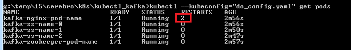
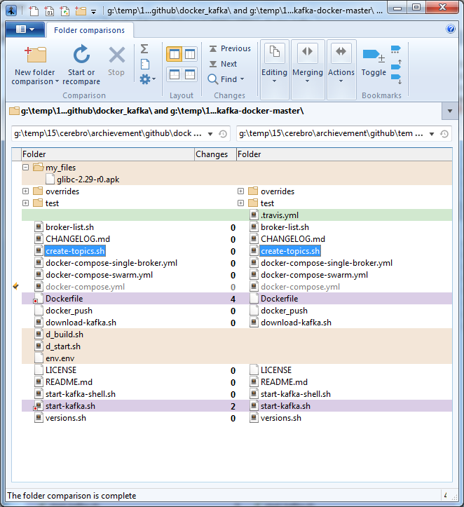
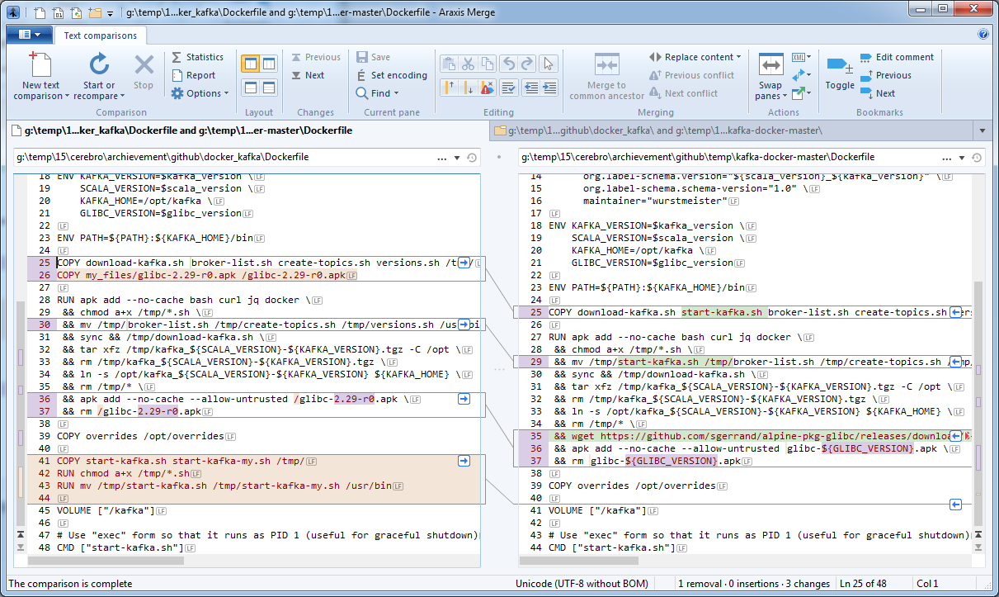
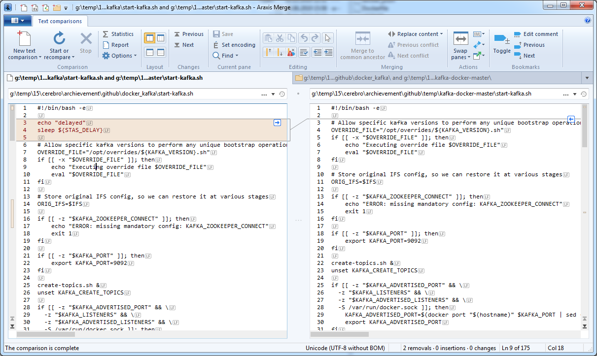
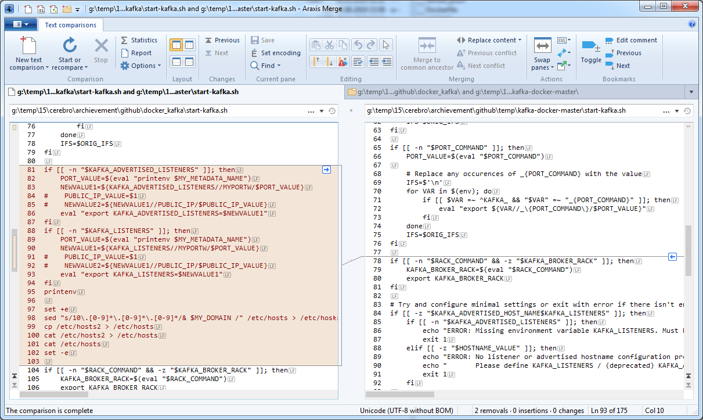

# Kubernetes. Kafka cluster in Digitalocean.

Main point is in external access outside Kubernetes using PLAINTEXT or SASL_PLAINTEXT (username/password).

It's needed to have a domain. Set IP for your domain when service "kafka-nginx-service-name" is created and Digitalocean assign IP to it.

Pods:

1) zookeeper
2) 3 kafka pods - StatefulSet
3) nginx for external access



Docker
------------

I use docker image wurstmeister/kafka:2.3.0 with minor modifications.

Client properties
------------
```bash
String jaasTemplate = "org.apache.kafka.common.security.plain.PlainLoginModule required username=\"%s\" password=\"%s\" user_user01=\"%s\";";
String jaasCfg = String.format(jaasTemplate, "user01", "kKioHLT", "kKioHLT");

Properties props = new Properties();
props.put("bootstrap.servers", Consts.BOOTSTRAP_SERVERS);
props.put(ProducerConfig.KEY_SERIALIZER_CLASS_CONFIG, StringSerializer.class.getName());
props.put(ProducerConfig.VALUE_SERIALIZER_CLASS_CONFIG, StringSerializer.class.getName());
props.put(ConsumerConfig.GROUP_ID_CONFIG, "test-consumer-group");
props.put(ConsumerConfig.KEY_DESERIALIZER_CLASS_CONFIG, StringDeserializer.class.getName());
props.put(ConsumerConfig.VALUE_DESERIALIZER_CLASS_CONFIG, StringDeserializer.class.getName());
props.put(ConsumerConfig.ENABLE_AUTO_COMMIT_CONFIG, "false");
props.put(ConsumerConfig.AUTO_OFFSET_RESET_CONFIG, "latest"); // earliest, latest
props.put("security.protocol", "SASL_PLAINTEXT");
props.put("sasl.mechanism", "PLAIN");
props.put("sasl.jaas.config", jaasCfg);
```

Scaling up (video - 8 minutes)
------------

[](https://www.youtube.com/watch?v=l3vpN5les-U)

Screenshots
------------










